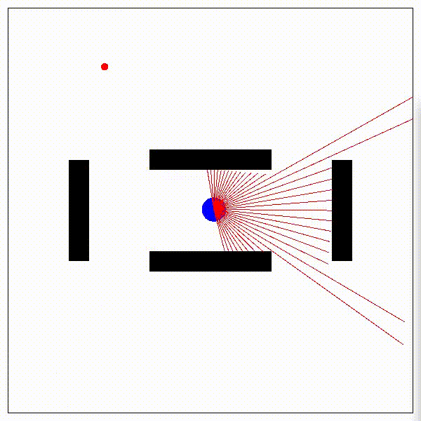

# Motion Planning with Deep Reinforcement Learning



## Installation
mpdrl can be installed from source code.
```
git clone https://github.com/Jumpei-Arima/mpdrl.git
cd mpdrl
pip install -e .
```

## Quick Start
You first compile environment.

```
cd envs/
./compile.sh
```

And you can train agent.

```
cd example
python run_ppo.py
```

If you want to check the learned policy,
```
python check_best_policy.py
```
